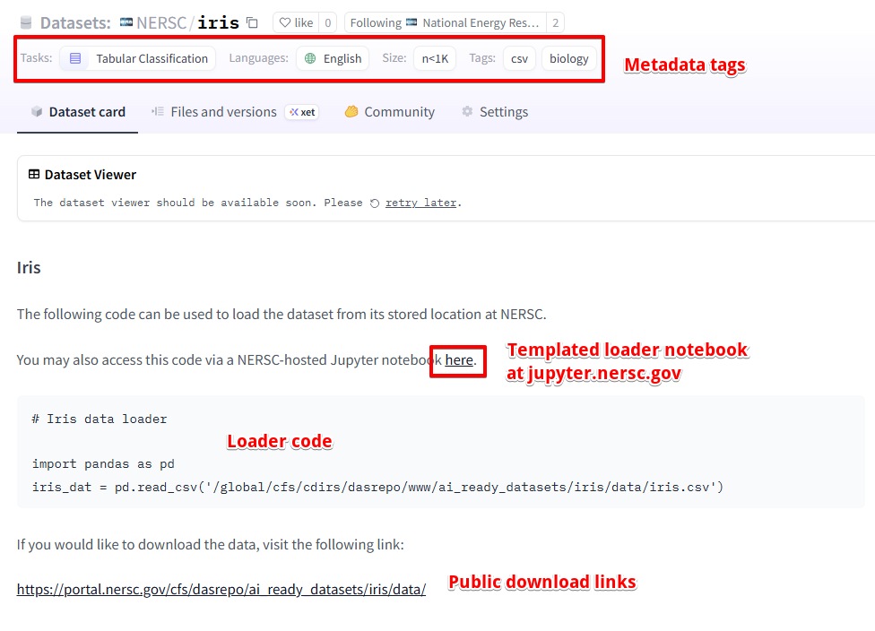

# HuggingNERSC

An API that interfaces with the NERSC organization on Hugging Face (https://huggingface.co/NERSC), enabling users to catalog their datasets on a Hugging Face repo and link them to their stored locations at NERSC.

A CLI is also provided to catalog new datasets and upload already-cataloged datasets, implementing the HuggingNERSC API under-the-hood.

## The CLI

### What Does it Do?

Easily curate a dataset in a repo on the NERSC Hugging Face organziation by executing a single line in a terminal. 

An example of a repo created for Sir Ronald Fisher's famous iris classification dataset is shown below.



See for yourself: https://huggingface.co/datasets/NERSC/iris

### Setup
To use the any of the CLI commands, first clone this repository.
```
git clone https://github.com/jbbutler/huggingnersc
```

Next, make sure to create and activate the conda environment with relevant software packages.
```
conda env create -f huggingnersc_env.yml
conda activate huggingnersc_env
```

### Cataloging a New Dataset
To catalog a new dataset on the NERSC Hugging Face organization, use the `catalog_new_dataset` command
```
python main.py catalog-new-dataset <official_name> <nickname> <loader_script> <portal_link> <metadata_json> <optional: batch_script> <optional: is_distributed>
```
with the following specifications
+ `<official_name>`: the title of your dataset that you want displayed on the repo page
+ `<nickname>`: the name to use in filepaths
+ `<loader_script>`: a script to load up the data
+ `<portal_link>`: the link to your dataset on portal.nersc.gov
+ `<metadata_json>`: a json file containing metadata tags, etc. you want displayed on the repo dataset card (NOTE: must comply with schema in `metadata_schema.json`; more on this later)
+ `<batch_script>`: an optional parameter, defaults to `None`; if you want to provide a batch script to run your data loader code (useful for multi-node distributed data loaders)
+ `<is_distributed>`: an optional parameter, defaults to `False`; if providing a distributed data loader, will not template a Jupyter notebook (*Pending me figuring out how to provide distributed data loaders on jupyter.nersc.gov...*)

### Inspecting an Already-Cataloged Dataset
To see all the information associated with an already-cataloged dataset (location on HuggingFace, location at NERSC, etc.), use the `inspect_dataset` command
```
python main.py inspect-dataset `<nickname>` 
```
where `<nickname>` is the title of the desired dataset used in filepaths.

### Metadata JSON
As mentioned before, the metadata files supplied when cataloging a dataset must adhere to the schema in `metadata_schema.json`. This is to enforce some degree of uniformity among the metadata categories across datasets, making things a bit more organized. Also, metadata needs to be suppied to Hugging Face in a particular way for things not to break, so this helps things run smoothly.

In the json file, you need two keys: `datacard_tags` and `other_info`. The former is for configuring your tags on the Hugging Face dataset card, and the latter is for all other metadata. Datacard tags includes items like the license, language, ML task category (classification, regression, etc.), the size of your dataset, filetypes, domain, etc. Other info is any nickname or papers associated with your dataset. Note: if you provide an arXiv link, a tag linking to the arXiv entry will appear among the other datacard tags.

More precisely, below we provide the overall structure with valid key names and valid metadata.
+ `datacard_tags`
  - `license`
    - type: string
    - valid options: 'apache-2.0', 'mit', 'bsd', 'bsd-2-clause', 'bsd-3-clause', 'bsd-3-clause-clear', 'cc', 'wtfpl', 'unlicense'  
  - `task_categories`
    - type: array of at least one string
    - valid options: 'text-classification', 'feature-extraction', 'image-classification', 'image-segmentation', 'audio-classification', 'tabular-classification', 'tabular-regression'
  - `size_categories` (required)
    - type: string
    - valid options: 'n<1K', '1K<n<10K', '10K<n<100K', '100K<n<1M', '1M<n<10M', '10M<n<100M', '100M<n<1B', '1B<n<10B', '10B<n<100B', '100B<n<1T', 'n>1T'  
  - `language`
    - type: array of at least one string
    - valid options: 'en', 'zh', 'fr', 'es', 'ru', 'ko', 'hi'
  - `tags` (other tags you want displayed at the top of your datacard)
    - type: array of at least one string
    - valid options: 'csv', 'hdf5', 'netcdf', 'txt', 'particle physics', 'cosmology', 'weather/climate', 'biology', 'chemistry'
  - `pretty_name` (display title of your dataset; required)
    - type: string
+ `other_info`
  - `nickname` (nickname of dataset to appear in filepaths)
  - `papers` (will display links in README; arXiv links will also be given tags at the top of the datacard)
    - type: array of at least 1 string 
